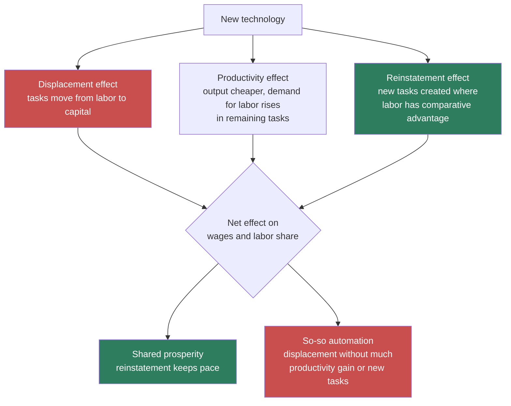

**Adam asked:** *"I'd love a rabbit hole specifically explaining the Acemoglu and Restrepo papers. What is the general thesis of these works. Provide some historic context towards the importance of them in economic thought and how have they evolved. They seem to be important to understanding this conversation."* — and separately, *"Can you summarize and link to those papers"*

---

## The problem they were solving

Before this work, the dominant model was **skill-biased technical change** (SBTC). Technology raises the productivity of skilled workers more than unskilled ones; inequality rises because the skill premium rises; everyone's wages still rise, just unevenly. It fit the 1980s well.

It fit the 2000s badly. Real wages for non-college men fell. Employment polarized — growth at the top and bottom, hollowing in the middle. SBTC has no mechanism for a group's wages going *down* in absolute terms, because in that model technology always raises the marginal product of labor.

The task framework's core move: **technology does not augment workers, it reallocates tasks.** If a task moves from labor to capital, the workers who specialized in it lose the task itself — not merely relative standing. Their wages can fall absolutely. That is the thing SBTC could not produce and the data demanded.

## The three effects

**"So-so automation"** is their term for the worst case and it is the key concept for the AI argument: technology just good enough to replace a worker, not good enough to generate much productivity gain. Self-checkout is the standard example. You get displacement with a small productivity effect and no new tasks — the mix Acemoglu fears AI is producing.

## The papers, in order

| Year | Paper | What it added |
|---|---|---|
| 2011 | Acemoglu & Autor, ["Skills, Tasks and Technologies"](https://economics.mit.edu/sites/default/files/publications/Skills%2C%20Tasks%20and%20Technologies%20-%20Implications%20for%20E.pdf) (*Handbook of Labor Economics*) | The framework itself. Tasks, not skills, are the unit. |
| 2018 | ["The Race Between Man and Machine"](https://www.aeaweb.org/articles?id=10.1257/aer.20160696) (*AER* 108:6) | The formal model. Automation vs. new tasks as a race; a balanced-growth path exists only if they stay in step. |
| 2019 | ["Automation and New Tasks"](https://www.aeaweb.org/articles?id=10.1257/jep.33.2.3) (*JEP* 33:2) | The readable one. **Start here if you read only one.** |
| 2020 | ["Robots and Jobs: Evidence from US Labor Markets"](https://www.journals.uchicago.edu/doi/abs/10.1086/705716) (*JPE* 128:6) | The empirical anchor. See numbers below. |
| 2022 | ["Tasks, Automation, and the Rise in US Wage Inequality"](https://economics.mit.edu/sites/default/files/2022-10/Tasks%20Automation%20and%20the%20Rise%20in%20US%20Wage%20Inequality.pdf) (*Econometrica* 90:5) | Attributes 50–70% of the change in US wage structure 1980–2016 to task displacement |
| 2022 | ["Demographics and Automation"](https://www.nber.org/papers/w24421) (*ReStud*) | The flip side: aging *causes* automation, and that's fine |
| 2024 | ["The Simple Macroeconomics of AI"](https://www.nber.org/papers/w32487) | Applies the framework to AI → see [[AI Growth Forecasts - Whose Timeline]] |
| 2026 | Acemoglu, Autor, Beirne & Scott, ["Baby Busts and Growth Booms"](https://www.nber.org/papers/w35401) | The optimistic turn Cowen presses him on |

### The robots number

The headline result from the 2020 *JPE* paper, using variation in robot adoption across US commuting zones 1990–2007:

> **One additional robot per thousand workers reduces the employment-to-population ratio by about 0.2 percentage points and wages by about 0.42%.**

Reported ranges across specifications: **−0.18 to −0.34 pp** on employment, **−0.25% to −0.5%** on wages. The identification rests on areas most exposed to robots after 1990 showing no differential trend before 1990.

## How the position evolved

This is the part worth noticing, because it is not a straight line.

1. **2011–2018 — building the machine.** Establish that tasks are the right unit and that displacement is real.
2. **2018–2022 — the pessimistic empirical phase.** Robots lower wages. Task displacement explains most of rising inequality. This is the Acemoglu most people know.
3. **2022 onward — the conditional turn.** *Demographics and Automation* shows automation triggered by labor scarcity is good. The 2026 *Baby Busts* paper finds falling birth rates associated with **higher** GDP growth per working-age adult, via labor-saving innovation. Cowen catches this and asks whether it contradicts the Restrepo work. Acemoglu says no, and he is right: both use the same framework. The framework was always conditional. **Automation responding to scarcity is a different animal from automation replacing available workers.**

That is why he can say "I am not, 100 percent not, against automation" without contradiction, and why he sounds pessimistic anyway. The model is neutral. His read of *current conditions* is not.

## Where Cowen attacks

Cowen's move in this conversation is to grant the micro and deny the macro: fine at the firm and sector level, but the aggregate labor share barely moved — "62 to 60" adjusting for equity compensation — and automation since the Industrial Revolution has plainly made workers richer. Acemoglu's reply is that the macro series is not a test of automation because it bundles automation with everything else, including new task creation, which he estimates accounts for **40–50%** of what the US labor market currently supports. Full treatment in [[Automation and the Labor Share]].

## From the book

*What Happened to Liberal Democracy?* carries this machinery without the notation, mostly in **Chapter 6, *Pathway to Crisis***, and it supplies the numbers the interview only alludes to.

**The 50–70% figure is in the book, not just in the *Econometrica* abstract:**

> *"Recent estimates suggest that between 50 and 70 percent of the surge in U.S. wage inequality over the last four decades can be accounted for by the effects of automation, and that much of the decline in the wages of low-education demographic groups, such as young men with a high school degree or less, can be explained by the spread of automation tools."*

**And the robot adoption series it rests on:** the US went from about **3.5 robots per 1,000 industrial workers in 1993 to 15 in 2014 and 25.5 by 2020**. Germany reached roughly twice the US density.

**The displacement mechanism, stated plainly** — this is the task framework in prose:

> *"Recall that in the industrial compact, as companies reached larger markets and increased their production volume, they also hired more workers, generating both jobs and, for your labour market competition, higher wages. With automation, this latter link was broken. Firms could expand and output could multiply without any need to hire more workers."*

**The carmaker claim is verified — with corrections.** The example that this page called *"doing enormous work in his argument"* and worth its own page in draft 2 is in Chapter 6, and three details in the interview version don't survive:

| The interview says | The book says |
|---|---|
| Japanese, Korean and German | German, in detail; then *"comparable adjustments were made in Japan, Finland, the Netherlands, Norway, and Sweden."* **Korea is not among them.** |
| Carmakers | German manufacturing generally, via **Industry 4.0** and Digital Factory. Autos are the *American* half of the contrast. |
| Redesigned jobs around robots | Retrained blue-collar workers into technical and supervisory occupations, and deployed computer-aided design and quality-control tools usable **without a college degree** — credited to Douglas Engelbart. |

The core of it holds, and is stronger than the interview version because the comparison is embarrassing for the simple technological story:

> *"German manufacturing firms have introduced industrial robots considerably faster than their American counterparts… But German manufacturing companies must negotiate with worker representatives and unions when making these choices… robot adoption in Germany was not associated with large employment drops. Blue-collar work declined, but there were concurrent increases in technical occupations."*

**More robots, fewer layoffs.** And the within-Germany variation is the part that makes it evidence rather than anecdote: *"in establishments where labor was better organized, there were less steep employment declines, and more pronounced efforts to reallocate blue-collar workers to technical tasks."* Same country, same technology, same decade — the difference is who was in the room. That is the strongest empirical support for the "choice" claim anywhere in the conversation, exactly as this page suspected.

**On the American side**, the book gives the autos numbers the interview does not: the sector paid *"about 40% higher wages to Americans without a college degree than the rest of the economy,"* and employment of workers with a high-school degree or less fell from **625,000 in the 1960s to 371,000 by 2010**.

---

## Working notes

**Confidence.** The framework, the paper list, and the robots coefficients are solid and checkable. The 50–70% figure is from the *Econometrica* abstract. The 40–50% new-tasks figure is Acemoglu's spoken number in this interview, attributed partly to Autor's [*The Work of the Future*](https://mitpress.mit.edu/9780262547307/the-work-of-the-future/) — I have **not** verified it against a printed source and it should not be quoted as precise.

**⚠ Unverified: the Barany, Patel and Siegel paper.** Cowen cites [CEPR DP21700](https://cepr.org/publications/dp21700) on France through 2019 finding no labor-share harm. CEPR blocks automated fetching (HTTP 403) and the paper does not surface in search. There *is* a related January 2026 paper by Aseem Patel, ["Labour Market Power and Automation"](https://papers.ssrn.com/sol3/papers.cfm?abstract_id=6075686), using French administrative data — **not the same paper**, and I should not pretend it is. Someone with CEPR access should pull DP21700 and check what it actually claims. Acemoglu's on-air response was "I don't know this new paper," so the exchange is unresolved on both sides.

**The most useful unasked question — now answered.** Draft 1 said the Japanese/Korean/German carmaker example was doing enormous work in his argument, was unverified, and would be the strongest empirical support for the "choice" claim if it held up. **It holds up**, in Chapter 6, with three corrections: no Korea, German manufacturing rather than carmakers, and retraining under Industry 4.0 rather than job redesign around robots. Written up above. It is still worth its own page in draft 2 — more so now, because the within-Germany establishment-level variation is a cleaner identification than the cross-country comparison the interview offers.

The same claim appears on [[Working-Class Liberalism and Community Elbow Room]] with the same corrections applied.

**Still unverified after the book check:** the 40–50% new-tasks figure (not in the book) and the Barany–Patel–Siegel paper above (not in the book either — it postdates it, and Acemoglu says on air he hasn't read it).

**Source and its limits.** Checked against the audiobook edition (Penguin Random House Audio, narrated by John Lee), machine-transcribed, so references are by chapter and quotations are transcribed speech. Numbers transcribed by machine deserve particular suspicion — the robot-density and employment figures above should be confirmed against print before republication.

**Related:** [[Automation and the Labor Share]] · [[AI Growth Forecasts - Whose Timeline]] · [[Induced Innovation and the Habakkuk Thesis]] · [[King and Plosser - Real Business Cycles]]
