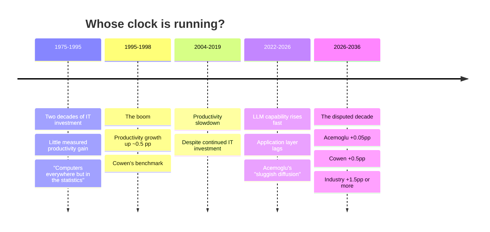

**Adam asked:** *"A good amount of this conversation is economists arguing over timelines… I would love to see a rabbit hole around timelines for some of these arguments. What I mean is like a timeline understanding what game-changer means over time. What does GDP growth look like with an OpenAI assumption versus Acemoglu assumption for example."*

---

## The scenarios, compounded

US GDP ≈ **$30 trillion** (2026, approximate). Baseline real growth assumed at **2.0%/yr**. Ten years, 2026 → 2036.

| Scenario | AI adds to annual growth | Growth rate | GDP in 2036 | Extra vs. baseline |
|---|---|---|---|---|
| **Baseline** — no AI effect | — | 2.00% | $36.6T | — |
| **Acemoglu (2024)** | +0.05 pp | 2.05% | $36.8T | **+$0.18T** |
| **Cowen's floor** ("half a percentage point") | +0.5 pp | 2.50% | $38.4T | **+$1.8T** |
| **Goldman Sachs (2023)** | +1.5 pp | 3.50% | $42.3T | **+$5.8T** |
| **Explosive growth** (transformative-AI literature) | +10 pp | 12.00% | $93.2T | **+$56.6T** |

*Arithmetic is mine and simple — constant growth rates compounded over ten years. It is a way of making the assumptions comparable, not a forecast. See working notes for what it hides.*

The ratio worth staring at: **Cowen's "modest, easily imaginable" number is ten times Acemoglu's published estimate.** When Cowen says "I would be shocked if what we have now didn't do at least as much for us" as the 1995–98 IT boom, he is proposing something Acemoglu's model treats as far out of range. And Acemoglu's reply is not a rebuttal — it is *"I think that would be an amazing thing. Our society would be so much better. I wish it were."*

## Where Acemoglu's number comes from

["The Simple Macroeconomics of AI"](https://www.nber.org/papers/w32487) (NBER w32487, 2024) does not forecast in the industry sense. It applies **Hulten's theorem**: the aggregate productivity gain equals the fraction of tasks affected × the average cost saving on those tasks. Feed in the published task-exposure estimates and out comes a small number.

| Quantity | Estimate | Per year |
|---|---|---|
| TFP gain over 10 years | **0.53% – 0.66%** | ~0.05–0.07% |
| GDP gain over 10 years | **~0.9% – 1.1%** | ~0.09–0.11% |

The paper's own hedge is important and Acemoglu repeats it on air: early task-level evidence comes from **easy-to-learn tasks**, so extrapolating it to hard tasks probably *overstates* the gain. That is why he lands at the low end.

**What he now concedes.** Asked directly whether he'd revise: *"Yes. If I were writing that today, I would revise my estimates, but the general point remains."* He separates the paper into three claims and updates only one:

1. The *framework* — gains come from new things plus cost savings. **Unchanged.**
2. The *numbers*. **Revised up** — models advanced faster than he expected.
3. The *rhetorical point* — industry estimates need grounding. **Unchanged.**

And he adds a genuine counterweight: applications built on the models "have been developing pretty sluggishly." His revision is up on capability, down on diffusion.

## What "game-changer" means — the definitional problem

Adam asked for this specifically, and it turns out to be where the argument actually lives. There is no shared threshold:

| Standard | Rough threshold | Who uses it |
|---|---|---|
| **Statistically visible** | +0.2 pp/yr | Economists; enough to detect in the data |
| **Historically normal boom** | +0.5 pp/yr | Cowen's benchmark, from IT 1995–98 |
| **Comparable to electrification** | +1.0–1.5 pp/yr sustained | Goldman; the "general purpose technology" case |
| **Regime change** | +5 pp/yr or more | Transformative-AI literature |
| **Acemoglu's actual position** | ~+0.1 pp/yr, arriving lumpy | This paper |

Note the last row carefully. Acemoglu does **not** predict a smooth trickle. His stated expectation is *"there will be one or two years of very rapid growth"* inside an otherwise ordinary decade. His model of the 1980–2008 period is the template: unimpressive on average, with bursts inside it.

This is why the two men talk past each other on timing. Cowen points at 1995–98 and says *look how fast it moved*. Acemoglu points at 1975–2008 and says *that boom took twenty years of prior investment to arrive*. **Both are describing the same history with different window sizes.** Neither is wrong about the data.

## The Solow paradox, which is the real precedent

Robert Solow, 1987: *"You can see the computer age everywhere but in the productivity statistics."* He was right for about eight more years, and then he was wrong. The productivity gain showed up in the late 1990s.

That episode is the single most useful precedent, and it cuts **both ways**:

- **For Cowen:** measured productivity lags real capability. Absence of evidence now is not evidence of absence.
- **For Acemoglu:** the lag was *twenty years*, and the eventual boom was +0.5 pp for a few years — not a regime change. If AI follows the IT template exactly, the industry forecasts are still wrong by an order of magnitude.

## Reading

- Acemoglu, ["The Simple Macroeconomics of AI"](https://www.nber.org/papers/w32487) (2024) — the source of the low number
- Briggs & Kodnani, "The Potentially Large Effects of AI on Economic Growth," Goldman Sachs (2023) — the +1.5 pp case
- Brynjolfsson, Rock & Syverson, "The Productivity J-Curve" (2021) — why gains lag investment; the best formal statement of the Solow-paradox mechanism
- Aghion, Jones & Jones, "Artificial Intelligence and Economic Growth" (2019) — the theoretical route to explosive growth
- Autor, ["The Work of the Future"](https://mitpress.mit.edu/9780262547307/the-work-of-the-future/) — the measured middle

## From the book

*What Happened to Liberal Democracy?* takes the same position and **prints no number for it.** Chapter 9 states it in words:

> *"My reading of the evidence is that the benefits from AI-based automation in the medium term, though non-trivial, are not huge. The rollout of AI will be slow, as is the rollout of any technology that requires major organizational changes."*

The Hulten's-theorem arithmetic above, and the 0.53–0.66% TFP figure, live in the paper and not in the book. So the table's Acemoglu row is sourced correctly — it just has no counterpart in the book a general reader would pick up, which means the version of his position most people will encounter is *"non-trivial, not huge"* and a claim about organizational adoption speed.

**The distribution argument is the one the book actually cares about,** and it is where he spends his words:

> *"Even if such benefits were realized, how would they be distributed? The most natural path to broad-based benefits from productivity improvements would be via shared prosperity, working through higher wages for all sorts of work, and skills. This is what the Industrial Compact achieved until its unravelling in the early 1980s. But if all the gains are from automation, without the pro-worker AI possibilities I discuss below, then wage increases will not follow, and in fact, mass-scale automation could lead to significant joblessness."*

He then closes the obvious escape hatch — broad AI ownership, or universal basic income — on two grounds. Political economy: *"Large tech companies would not be enthusiastic about redistributing all of their profits to the broader population."* And, more interestingly, a social objection that has nothing to do with money: *"A society in which a large fraction of the population does not contribute to production or other beneficial activities would create huge social status gaps between the makers and the takers… Communities are most vibrant when their members feel they are contributing to society at large."*

**This reframes the table.** Compounding the scenarios makes the disagreement legible as a disagreement about *size*, and on the book's own account size is the second question. Acemoglu's position is that the explosive-growth row could be right and his objection would survive intact, because a large enough automation-only gain is a *worse* outcome on his framework than a small pro-worker one. The interview never says this and the table above cannot show it: **the rows are not ranked the way their totals are.** That is the missing column, and it is not a number.

**On the AGI question underneath the timelines**, the book is more explicit than the interview: *"A quick transition to AGI seems unlikely, in part because existing models still do not show evidence of true comprehension or deep understanding, even in simple contexts"* — the illustration being that a model can explain how to repair a garage door while having *"no recognition of the social context of this problem,"* and that *"as far as they are concerned, there is no difference between repairing a garage door, summarizing an ancient text, and diagnosing cancer."* Whether that is a claim about current systems or about the architecture is left open, which is the same ambiguity the interview leaves.

---

## Working notes

**What the table hides, and it matters.** Constant compounding is the wrong shape for what anyone actually believes. Acemoglu explicitly predicts lumpiness — a couple of fast years inside a slow decade — and the transformative-AI scenarios are *accelerating*, not constant. A more honest version plots cumulative GDP paths with different curvature rather than five straight lines. **That's a real chart and I'd build it in draft 2 if you want it.** The numbers above are right for the assumptions stated and should be read as "what does each position imply if you take it literally and hold it fixed" — nothing more.

**Sourcing.** The Acemoglu figures are from the published paper and are solid. The $30T US GDP base is approximate and rounded. The Goldman +1.5 pp and the explosive-growth +10 pp are **stylized representatives of a range**, not quotations — Goldman's headline was a 7% global GDP uplift over a decade, which I've converted to a US annual-growth equivalent, and that conversion is mine. Do not attribute the +1.5 pp to Goldman as a direct quote without checking their report.

**The 2026 update problem.** Cowen's framing — "Anthropic is a trillion-dollar company, revenue through the ceiling" — is doing rhetorical work that the economics doesn't support. Firm valuation is not productivity. A company can be worth a trillion dollars by capturing existing surplus rather than creating new output, which is precisely the distinction Acemoglu's whole framework is built on. **Neither man says this out loud** and it's arguably the biggest unexamined move in the segment.

**Draft 2 should add:** actual measured US TFP growth 2022–2026 as a scoreboard row. If AI were already producing Goldman-scale gains we would be starting to see it. That is a checkable fact and it would date-stamp the argument rather than leaving it hypothetical.

**And a distribution column.** The book check (above) shows the table is ranking the scenarios on a dimension Acemoglu treats as secondary. A second column — who gets the gains under each scenario — would make the comparison his rather than merely arithmetic. It cannot be filled with numbers, which is precisely why it is worth adding.

**Source and its limits.** Checked against the audiobook edition (Penguin Random House Audio, narrated by John Lee), machine-transcribed, so references are by chapter and quotations are transcribed speech. Confirmed by the check: the book carries no growth or TFP figures for AI at all, so nothing in the table above needs re-sourcing to it.

**Related:** [Acemoglu and Restrepo - The Task Framework](/research/acemoglu-and-restrepo-the-task-framework/) · [Automation and the Labor Share](/research/automation-and-the-labor-share/) · [Pro-Worker AI](/research/pro-worker-ai/)
