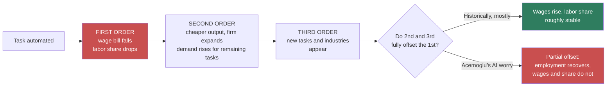

**Adam asked:** *"This might be too much to ask, but I'd really like to go down a rabbit hole on this. I'd love to see some chart showing this. If I understand what he's saying it's that people might get another job, but it's not as well paid. I'd love some references on that. Also, the 'first-order impact' is something I'd like to be explained more as well. What is he describing when he's saying that."*

---

## What "first-order impact" means

Economists decompose an effect into orders. The first order is the direct arithmetic consequence; higher orders are the adjustments the system makes in response.

**The labor share** is compensation to workers divided by total output. Suppose a factory produces $100 of output, pays $60 in wages and $40 to capital. Labor share is 60%.

Now automate a task that had been done by a worker earning $10.

- **First order:** that $10 moves from the wage bill to the capital bill. $50 of $100 → labor share 50%. Nothing else has happened yet. This is what Acemoglu means by *"That has a first-order impact on the labor share because fewer things are done by labor."* It is not a prediction, it is bookkeeping.
- **Second order:** production is cheaper, so the firm expands. Demand rises for the tasks still done by people. Some of the $10 comes back.
- **Third order:** new products and new jobs appear that did not exist. More comes back.

His claim, in one sentence: *"there could be enough demand from nonautomated tasks for labor, but that would never come back to increase the wage enough to restore the labor share to where it is."* The second-order effects are real; they are just not complete.

## Your reading, checked: do displaced workers earn less?

Yes — this is one of the better-established findings in labor economics, and it predates the automation debate.

| Finding | Magnitude | Source |
|---|---|---|
| Displaced workers' long-run earnings loss (high-tenure, mass layoff) | **~15–20% below** pre-displacement trajectory, persisting 15–20 years | Jacobson, LaLonde & Sullivan (1993); Davis & von Wachter (2011) |
| Robot exposure: local labor market effect | **−0.2 pp** employment-to-population, **−0.42%** wages per robot/1,000 workers | [Acemoglu & Restrepo, *JPE* 2020](https://www.journals.uchicago.edu/doi/abs/10.1086/705716) |
| Share of 1980–2016 US wage-structure change attributable to task displacement | **50–70%** | [Acemoglu & Restrepo, *Econometrica* 2022](https://economics.mit.edu/sites/default/files/2022-10/Tasks%20Automation%20and%20the%20Rise%20in%20US%20Wage%20Inequality.pdf) |
| Trade-displaced manufacturing workers (comparison case) | Persistent earnings losses, low reallocation out of affected areas | Autor, Dorn & Hanson, "The China Shock" (2013) |

The mechanism is specificity: a welder's wage reflected skill in welding. Remove welding and the general labor market does not value that history. The worker is re-employed — often quickly — at a wage set by whatever they can do next.

**Acemoglu's precise version in this conversation:** *"the wages of people who used to be in especially blue-collar heavy manual tasks that were the ones that robots of the 1990s and 2000s went after, like welding and painting… went down quite a bit"* — both in aggregate and in local labor markets.

## The chart you asked for — and why it is a fight, not a line

Here is the US labor share, nonfarm business sector. **Read the caveat below before using these numbers.**

| Period | Labor share (approx.) |
|---|---|
| 1947 Q1 | 65.8% |
| Late 1940s – early 2000s | ~63%, fluctuating, no trend |
| 2000 Q4 | 62.8% |
| 2005 | falls below 60% |
| 2011 Q4 | 56.0% (trough) |
| 2013 | ~56.7% |

*Source: BLS nonfarm business sector labor share, as reported in [BLS TED](https://www.bls.gov/opub/ted/2017/labor-share-of-output-has-declined-since-1947.htm) and the [FRBSF working paper](https://www.frbsf.org/wp-content/uploads/wp2013-27.pdf).*

**The caveat is the substance.** Cowen says "62 to 60"; the BLS headline series says roughly 66 to 57. Both are defensible, because the labor share is one of the most measurement-sensitive statistics in economics:

- **Proprietors' income.** A sole proprietor's income is part wage, part profit, and the split is a modeling assumption. Elsby, Hobijn & Şahin (2013) find **one-third of the measured BLS decline** comes from how this is handled.
- **Equity compensation.** Cowen's adjustment. Stock grants to employees are labor income economically but land oddly in the accounts. Including them raises the recent labor share materially.
- **Housing and depreciation.** Imputed rent on owner-occupied housing is all "capital." Rognlie (2015) showed much of the apparent capital-share rise is housing, not robots.
- **Sector vs. aggregate.** Acemoglu's claim is explicitly at the firm and sector level, where he says evidence and theory "are very well aligned." He concedes the macro series is contaminated: *"those are macro things"*, and there are *"composition effects between like Walmart effects."*

So the honest framing is: **Cowen and Acemoglu are not disagreeing about a number. They are disagreeing about which number is the right question.** Cowen points at an aggregate that barely moved and says the worry is overblown. Acemoglu says the aggregate bundles automation with new-task creation and therefore cannot test his claim, which is about automation held separately.

## Reading

- Acemoglu & Restrepo, ["Automation and New Tasks"](https://www.aeaweb.org/articles?id=10.1257/jep.33.2.3), *JEP* 2019 — the accessible statement
- Acemoglu & Restrepo, ["Robots and Jobs"](https://www.journals.uchicago.edu/doi/abs/10.1086/705716), *JPE* 2020 — the empirics
- Elsby, Hobijn & Şahin, ["The Decline of the U.S. Labor Share"](https://www.brookings.edu/bpea-articles/the-decline-of-the-u-s-labor-share/), *BPEA* 2013 — why the measurement fight is real
- Autor, ["The Work of the Future"](https://mitpress.mit.edu/9780262547307/the-work-of-the-future/) — the new-tasks accounting Acemoglu defers to
- Jacobson, LaLonde & Sullivan (1993), "Earnings Losses of Displaced Workers," *AER* — the origin of the scarring literature

---

## Working notes

**On the chart.** What Adam actually wants is a two-panel figure: labor share over time on top, and below it the wage path of workers in heavily-automated occupations versus everyone else. **Panel 1 I can source. Panel 2 does not exist as a clean public series** — it has to be constructed from the *Econometrica* paper's occupation-group decomposition, which means pulling their replication files. That is a real task, not a lookup. Flagging it rather than faking it.

The table above is the honest first draft: numbers with provenance, and the reason a single line would be misleading. If you want a rendered chart in draft 2, the decision to make is **which series** — and that decision is the argument, so it should be yours, not mine.

**Numbers I'd want double-checked before publication:** the 1947 Q1 65.8% and 2000 Q4 62.8% figures come through secondary sources quoting BLS, not from BLS directly. The Elsby/Hobijn/Şahin one-third result is from their abstract.

**What I could not resolve:** Cowen's "62 to 60, adjusting for equity compensation." I could not find the specific series he's using. It is plausibly Barkai (2020) or a Mercatus-adjacent calculation. Until that's identified, treat the 62→60 as a claim in an argument rather than a fact.

**Related:** [[Acemoglu and Restrepo - The Task Framework]] · [[AI Growth Forecasts - Whose Timeline]]
