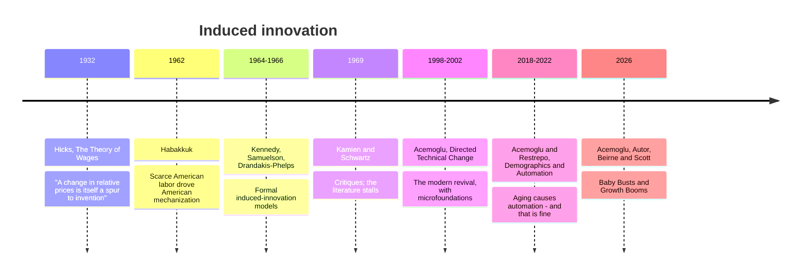

**Adam asked:** implicitly, via *"Who?"* and the request to explain the paragraph — see [King and Plosser - Real Business Cycles](/research/king-and-plosser-real-business-cycles/)

---

## Habakkuk's argument

Sir John Habakkuk, *[American and British Technology in the Nineteenth Century](https://archive.org/details/americanbritisht00haba/page/n5/mode/2up)* (1962) — Acemoglu links this exact edition in the transcript.

The puzzle: why did the United States, poorer and less industrially mature than Britain, adopt more mechanized production methods?

Habakkuk's answer: **abundant land made labor scarce.** A worker could always go west and farm, which put a floor under wages. Expensive labor made machinery relatively cheap, so American manufacturers mechanized aggressively — interchangeable parts, the "American system of manufactures" — while British firms, with cheap abundant labor, had less reason to.

The general principle: **the direction of technical change responds to relative factor prices.** Technology isn't an exogenous rain of ideas; it points wherever the expensive input is.

## The lineage

Acemoglu's own line — *"The models that I've been working on for the last 25 years on this topic always said that's a possibility"* — refers to his **directed technical change** work of the late 1990s and early 2000s, which supplied the market-size and price effects that make induced innovation work formally rather than as an intuition.

## Why it matters for the fertility argument

If technology is exogenous, fewer young workers simply means less output and a shrinking economy — the demographic panic.

If technology is **directed**, scarcity of young workers raises their relative price, which pushes innovation toward labor-saving methods, which raises output per worker. The demographic shock partly answers itself.

That is precisely what [*Baby Busts and Growth Booms*](https://www.nber.org/papers/w35401) claims to find empirically: regions and countries with fewer young workers show **more labor-saving patents, more high-tech activity, and higher TFP growth.**

## The caution Acemoglu himself puts on it

Twice, and both are important:

> *"it's not a certainty, but it's only after seeing the evidence that I'm more in that camp."*

and, on choice:

> *"In both papers, you also see the element of choice. You have to do the technology, and not every society does that technology in the same way. We could get that wrong."*

**This is the load-bearing connection to the rest of his work.** Induced innovation is a tendency, not a law. Automation that responds to genuine scarcity is good; the same automation deployed where labor is abundant is the displacement story of [Automation and the Labor Share](/research/automation-and-the-labor-share/). Same mechanism, opposite welfare consequence, depending on conditions.

It is also why the Habakkuk framing is a better fit for him than the RBC framing Cowen offered. RBC says the economy self-corrects. Habakkuk-via-Acemoglu says the economy *responds to incentives*, and whether the response is good depends on what the incentives are — which leaves plenty of room for policy and for getting it wrong.

## Reading
- Habakkuk, *[American and British Technology in the Nineteenth Century](https://archive.org/details/americanbritisht00haba/page/n5/mode/2up)* (1962)
- Hicks, *The Theory of Wages* (1932), ch. 6 — the original statement
- Acemoglu, "Directed Technical Change," *ReStud* 2002 — the modern foundation
- Acemoglu & Restrepo, ["Demographics and Automation"](https://www.nber.org/papers/w24421)

---

## Working notes
**Habakkuk's thesis is contested** and I should say so plainly: economic historians have pushed back for sixty years, notably on whether American labor really was that much scarcer once you account for skill mix, and on whether British firms were as unmechanized as the story requires. Peter Temin and others have argued the wage-gap evidence is weaker than Habakkuk claimed. Acemoglu calls it "intriguing," which is doing some work. **Draft 2 should give the counter-literature a proper paragraph** rather than the sentence it has here.

**Checked against the book: Habakkuk is not in it**, and neither is the nineteenth-century labor-scarcity literature. The book's version of "technology responds to conditions" is contemporary and institutional rather than historical — Chapter 6 on German versus American robot adoption, where the difference is union bargaining and apprenticeship rather than relative wages, and Chapter 9 on why business models and AGI ideology push AI toward automation. That is induced innovation with the inducement coming from institutions and beliefs instead of factor prices, which is a meaningfully different claim and arguably a more defensible one. Worth noting in draft 2 alongside the counter-literature: Acemoglu calls Habakkuk "intriguing" on air and builds on something else in print.

Checked against the audiobook edition (Penguin Random House Audio, narrated by John Lee), machine-transcribed; references are by chapter.

**Related:** [King and Plosser - Real Business Cycles](/research/king-and-plosser-real-business-cycles/) · [The Lucas Critique](/research/the-lucas-critique/) · [Acemoglu and Restrepo - The Task Framework](/research/acemoglu-and-restrepo-the-task-framework/) · [Automation and the Labor Share](/research/automation-and-the-labor-share/)
