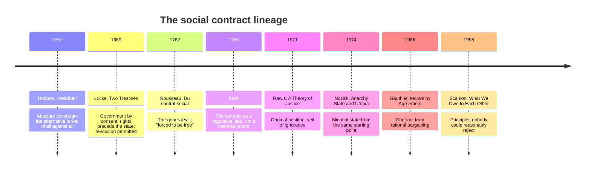

**Adam asked:** *"Rabbit hole on social contracts"*

---

## The idea and its lineage

Every social contract theory makes the same three moves:

1. **Imagine people outside political authority.** Hobbes's state of nature, Locke's, Rawls's "original position."
2. **Ask what they would agree to.** The answer is engineered by how you describe step 1.
3. **Treat that agreement as the source of legitimacy.** The state may do what people would have consented to, and no more.

The step-1 description does all the work. Hobbes describes the state of nature as terrifying and gets an absolute sovereign. Locke describes it as inconvenient but tolerable and gets a limited government. Rawls puts you behind a veil of ignorance and gets redistribution. **Nobody in any of these stories ever signed anything.**

## Why Rousseau is the sharp end

Acemoglu names "the Rousseau end of it," and that is the precise place to press.

Rousseau distinguishes the **general will** (*volonté générale*) — what the people collectively will when aiming at the common good — from the **will of all** (*volonté de tous*), the mere sum of private preferences. The general will is not a vote count. It is the right answer, and a majority can be wrong about it.

That produces the notorious line in Book I, Chapter 7: whoever refuses to obey the general will "shall be compelled to do so by the whole body," which "means nothing less than that he will be forced to be free."

Acemoglu's structural complaint is exactly this: **the general will is defined to outrank any actual agreement a real community reaches.** So when a community's shared values conflict with what the theory says the general will requires, the community loses by definition, not by argument. The hard question — how do we handle people who disagree with us, including intolerantly? — never gets asked.

## What he is proposing instead

From the transcript, his positive view has two layers:

- **A floor:** meaningful individual freedom, which he treats as the one non-negotiable, because "any kind of improvement in the human condition requires individual initiative."
- **Above the floor:** genuine consensus-building, with "enough elbow room to people to form their own community-level agreements."

He is explicit that this is *not* grounded in an external standard. Cowen presses him on it three times and he answers "I don't have one." That is a real philosophical cost and he pays it deliberately — see [[Rorty, Objectivism, and Moral Progress]] and [[The Book Problem]].

## The strongest objections to his objection

Worth holding, because he does not answer them in this conversation:

1. **Rawls already did this.** *Political Liberalism* (1993) introduces "overlapping consensus" precisely to handle deep disagreement — the idea that people with incompatible worldviews can converge on shared political principles for their own different reasons. That is a consensus mechanism, not a book of absolutes. Acemoglu says Rawls "goes into that direction" anyway; the transcript doesn't show why.
2. **The contract *is* the consensus device.** A contractarian can say the hypothetical agreement is not a substitute for consensus but a model of what consensus under fair conditions would look like.
3. **Without an external standard, what stops a community consensus that is monstrous?** His answer is the individual-freedom floor. Whether that floor is thick enough to do the work is the whole argument.

## Reading

| What | Why | Where |
|---|---|---|
| Rousseau, *The Social Contract* (1762), Book I–II | The general will, in his own words. Short. | [Gutenberg](https://www.gutenberg.org/ebooks/46333) |
| Hobbes, *Leviathan* (1651), ch. 13–18 | The founding move in its starkest form | [Gutenberg](https://www.gutenberg.org/ebooks/3207) |
| Locke, *Second Treatise* (1689) | Consent, property, the right of revolution | [Gutenberg](https://www.gutenberg.org/ebooks/7370) |
| Stanford Encyclopedia, "Contemporary Approaches to the Social Contract" | Best single map of the modern debate | [SEP](https://plato.stanford.edu/entries/contractarianism-contemporary/) |
| Hume, "Of the Original Contract" (1748) | The classic demolition: no one consented, and consent isn't why we obey | [essay](https://www.gutenberg.org/files/36120/36120-h/36120-h.htm) |
| Charles Mills, *The Racial Contract* (1997) | The other major modern critique — that the contract described a deal among some people, about everyone else | — |

---

## Working notes

**What I'm confident about:** the lineage, the general-will/will-of-all distinction, the "forced to be free" passage, and that step-1 framing determines the output. Standard material.

**What needs the book.** Acemoglu's claim that Rawls "goes into that direction" is the load-bearing one and the transcript doesn't defend it. My guess is he means Rawls's *lexical priority* rule — liberty first, then fair equality of opportunity, then the difference principle — which really does function as a rulebook for value clashes. That would make his target lexical priority specifically, not contractarianism generally. **Unverified.** Someone should read *What Happened to Liberal Democracy?* and check whether he names lexical priority. If he does, this page and [[The Book Problem]] merge into one argument.

**Where I think he's weakest:** he objects to a book, and then names one value (individual freedom) that outranks everything else. That is a one-line book. The difference between a short book and a long one is real but it is a difference of degree.

**Draft 2 should add:** what "community-level agreements" concretely means in his framework — currently split into [[Working-Class Liberalism and Community Elbow Room]] because Adam asked for a worked example there.
