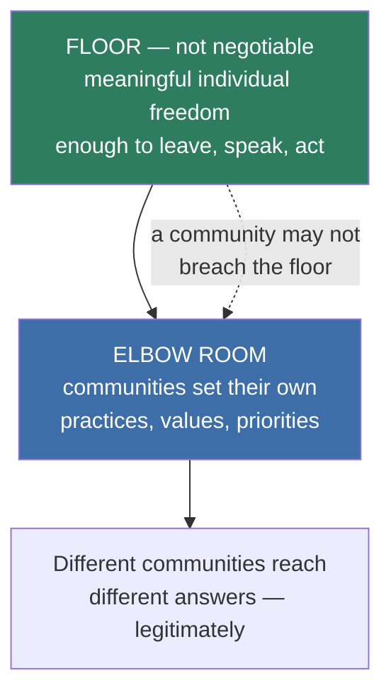

**Adam asked:** *"What does this mean? Can you provide what you believe is your best guess to an example on this?"*

---

## First, who counts as working class

He redefines it, and the redefinition is doing serious work:

> *"If you're getting your income from the labor market mostly, not from capital, not from your parents, then in my definition you're part of the working class."*

This is **enormous** — it takes in nurses, electricians, software engineers, journalists, small-business owners, and (he says, laughing) tenured MIT professors, "the edge of the working class." Cowen's challenge is fair: if the category includes almost everyone, does it mean anything?

Acemoglu's answer is that the unifying feature is not a shared job or a shared culture but a **shared structural position** — your income depends on your labor being wanted. And he accepts the cost: the class so defined is wildly heterogeneous, *"a very diverse set of skills,"* which is precisely why he needs communities to have their own practices and values. The elbow room is not a nice-to-have. **It is required by the breadth of his own definition.**

## The structure, as I read it

The critical asymmetry: **exit and voice are floor rights.** A community can adopt practices you dislike; it cannot stop you leaving, speaking, or organizing against them. That is what makes local variation liberal rather than merely local.

## My best guess at his example

He doesn't give one, so this is construction, flagged as such. The domain where his framework has the most content is **work**:

| Level | What gets decided | Who decides |
|---|---|---|
| Floor | The right to organize; freedom from coercion; ability to quit and be hired elsewhere; basic safety | National, non-negotiable |
| Elbow room | Scheduling, task design, training ladders, how new technology is introduced, what "a good job here" means | The workers and firm in that sector or place |

This fits the automation half of the interview exactly. His favorite example there is that **Japanese, Korean and German carmakers redesigned jobs around robots to create new tasks, while American firms mostly did not** — a difference not in the technology but in who had standing to shape its introduction. That is community-level agreement doing real economic work, and it is why he wants unions *reconstituted* rather than abolished, including the teachers' unions he criticizes.

Applied elsewhere, the same shape gives you: national floor on what every child must be taught and every child's right to leave; local discretion on how schooling is organized. Or a national floor on speech; local variation in norms about it.

## The hard case he avoids

What happens when a community's agreement is illiberal — restricting women's work, enforcing religious conformity, excluding outsiders? His answer has to be that the floor blocks it. But **the thinner the floor, the more it permits**; the thicker the floor, the more it becomes exactly the rulebook he rejects in [[The Book Problem]].

That is the same tension as everywhere else in his framework, and here it is at its most concrete. Cowen doesn't press it, and it is the question I'd most want asked.

---

## Working notes
**Everything after "My best guess" is my construction, not his text.** Adam asked for a best guess and I've given one, but it should be checked against *What Happened to Liberal Democracy?* before it's treated as his view. The workplace framing is the one his other commitments most obviously support; a different reader might reasonably build the example around local government or schooling instead.

**The Japanese/Korean/German carmaker claim is unverified** and it appears in three separate pages of this rabbit-hole set because it is load-bearing for the "technology is a choice" argument. **Verifying it is high value.** See [[Acemoglu and Restrepo - The Task Framework]].

**Related:** [[Social Contract Theory and Its Critics]] · [[The Book Problem]] · [[The Straussian View]] · [[Pro-Worker AI]]
